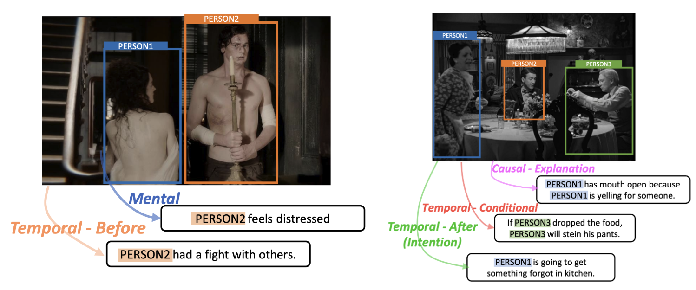

# Find Someone Who: Visual Commonsense Understanding in Human-Centric Grounding

[Haoxuan You](https://hxyou.github.io/), [Rui Sun*](https://threesr.github.io/), [Zhecan Wang*](https://www.zhecanwang.com/), [Kai-Wei Chang](http://web.cs.ucla.edu/~kwchang/), [Shih-Fu Chang](https://www.ee.columbia.edu/~sfchang/)

[*: equal contribution]

[Paper](https://arxiv.org/abs/2212.06971)



## Data:
Please download annotation data from [train/validation/test](https://drive.google.com/drive/folders/1ubKevPsbJJBCf04etcHj2rm_1obnygnl?usp=drive_link). 

Please also prepare the VCR image data/metadata because our annotations reuse them.

Here is a detailed explanation of different items in each data sample.
```
annot_id: Annotation id of the dataset
objects: Annotated objects (persons only)
boxes: box location of objects (x1,x2,y1,y2,s)  
img_fn: Image filename in VCR's raw data.
metadata_fn: Metadata filename in VCR's raw data.
statement: Commonsense description for the persons. If its element is a list of a number, it refers to a person, and the number in list is the index in objects and boxes. 
original_vcr_annot_id: Original annotation id in VCR
```